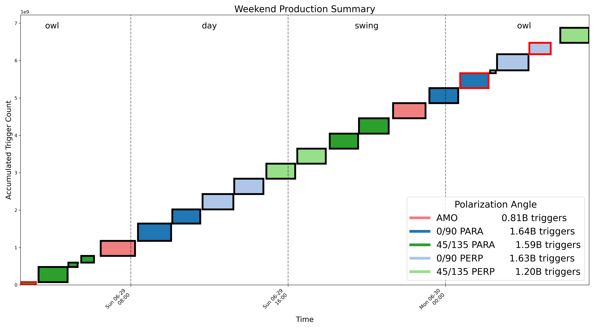

# Run Summary

This script queries GlueX RCDB and plots run durations and production summaries.

## Usage

`python run_summary_plotter.py -begin 132457 -end 132900`

## Example Figure

Here is an example production summary:

